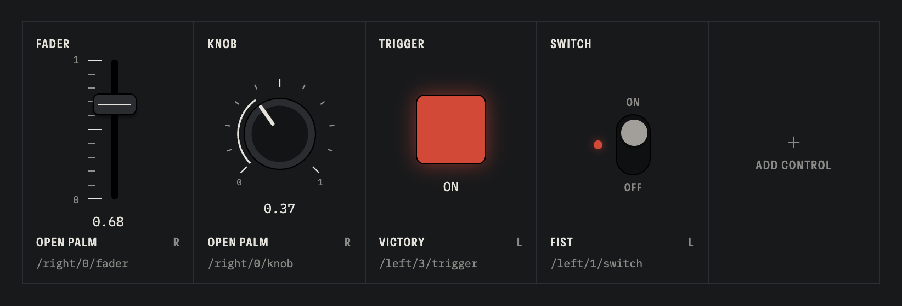

# Aether

Control your DAW with hand gestures. Aether tracks your hands through the webcam and sends OSC to Ableton Live, Bitwig or anything else that listens.



Download for macOS and Windows at [aether-osc.app](https://aether-osc.app).

## Controls

Each control pairs a hand and a gesture with one OSC address, `/{hand}/{gesture}/{mode}`, sent to `127.0.0.1:7099`.

| Mode | Sends |
| --- | --- |
| Trigger | `1` while the gesture is held, `0` when it ends |
| Switch | Flips between `1` and `0` each time the gesture starts |
| Fader | Hand height, `0` to `1` |
| Knob | Hand rotation, `0` to `1` |

Gestures and their index in the address: `0` open palm, `1` fist, `2` point up, `3` victory, `4` I love you. For example, `/right/0/fader` is the right hand's height while it shows an open palm.

## Development

```bash
bun install
bun run dev        # run the app
bun run dist:mac   # build an installer (or dist:win)
```

Hand tracking runs in a web worker in the app, and the Electron main process forwards its OSC packets over UDP. To use the dashboard in a browser instead, run `bun run dev:dashboard` and `bun run dev:cli`, which starts the same bridge on its own.

## License

MIT
